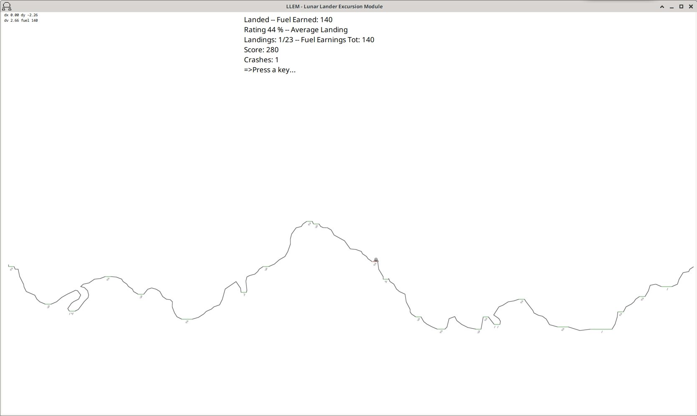
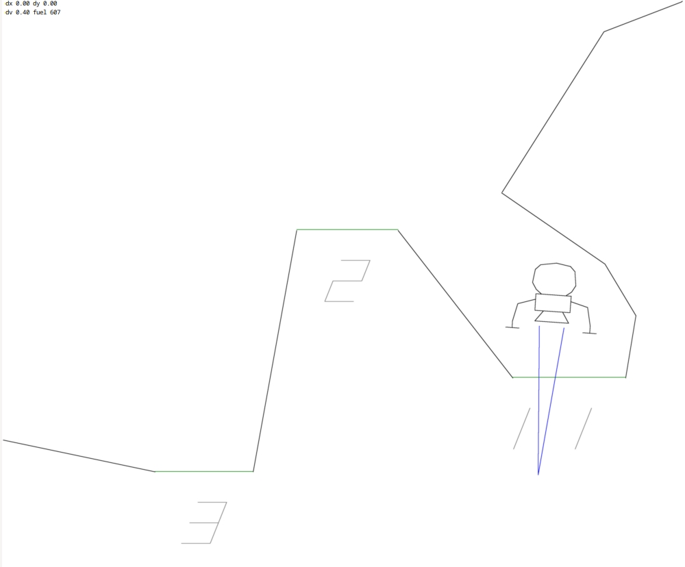
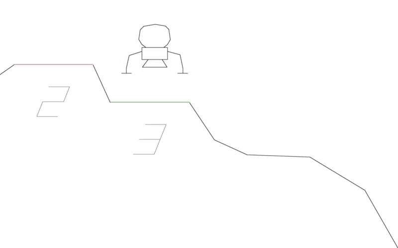

Sep-2022, v1.01

## LLEM - Lunar Lander Excursion Module
Lunar lander game with the regular features found in this type of game, it was inspired by the 1970's Atari vector graphics CRT arcade game. 
Features high quality line rendition which minimizes jaggies.
Try to land at various green landing zones to earn that zone's fuel stock, a once only reward. The softer the landing the more fuel you earn.
Landings are assessed at 2 points in the touchdown:
1) at your initial touchdown and its velocity(shown as dy in top left corner on window, its a negative value when descending),  
2) and after any lateral bounce diminishes (where you could skid into something or leave the touchdown zone) - this can be turned off in: 'Edit/Preferences'.   

There is also a llem ship and moonscape editing feature allowing the user to tailor a craft or landing scene.

## Build
Compliles with gnu gcc on Ubuntu 20.04. 
Requires: RTAudio, pulseaudio, jack, and FLTK libraries for linking, fltk-1.3.4-2 or better should work.

To build, type: make

No installation is required.

If it built without error, then run: './llem' from a folder where permissions for execution have been enabled, the app will read/create a 'LLEM.ini' settings file, and a 'highscore.txt' file.

## Details
The app uses white and frying pan noise with filtering for beefy/splatty engine thrust rumble, this is also used for a simplistic explosion sound.
Coded in c++ with a collection of older code I've written over the years, so there is a bit of remnant bloat and inconsistent coding conventions.
Last built on Ubuntu 20.04 via GNU C, therefore it's only tested on a linux PC.
Has a reasonable framerate on a modest PC (i3/3.7GHz) without an additional graphics card.

The graphics antialias line filterer is discretely coded. 
No SIMD is used, it's best to compile with optimizer set to max, such as -O3, this gives you a far better framerate (as defined in Makefile).
Enjoy.


## Game Play
'p' to toggle pause

proportional thrust: 'mousewheel',  or  'shift/ctrl' keys to dec/inc
pulse thrust: middle/right buttons, or 'cursor up or z'

rotate: 'cursor keys' or 'a, s/d' keys.

Adjust various settings in 'Edit/Preferences' menu.


Help 'help.txt' menu calls bash script 'open_editor.sh' (needs execution priveleges), edit script to point to a text editor, e.g: 'gedit $1&'

Help 'help.txt' menu calls bash script 'open_editor.sh' (needs execution priveleges), edit script to point to a text editor, e.g: 'gedit $1&'

## Development Mode
Enable Development Mode in 'Edit/Preferences' menu to add the developement menu to menubar.
You can modify 2 objs, the llem ship or the moonscape ground ('e' to go into editing mode, 'o' key to toggle which obj to edit), note some help hints are shown on screen.
Navigate to a particular line using PgUp/PgDwn, and switch line endpoints with cursor 'Up' key, adj zoom with '[]' keys. Note: lines have a 'line_type' showing they are either a ship line or a ground line, and what special function they have in those objs.  Use 'ctrl-c' to cycle 'line_type'. 

Ship lines can be either just a black drawn line you see belonging to the ship. Or, they can be normally invisible landing feet (i.e. the leg's foot pad) collision detection lines (green) or crash collision detections lines (red), these are only visible while editing. The ship's green landing pad collision detections lines must be around the actual drawn (visible) black landing pad lines, the more there are the better the collision detection will work (due to sampling nature of ship position update code). They must be completely horizontal (dy = 0, use 'l' key), and be in left and right pairs that share the same y value.

The moonscape's ground lines can be either just black drawn lines, or they can be landing zones (green) with a fuel amount (landing zones must be completely horiz, use 'l' key to set dy = 0). Landing zone lines must also be wide enough for a ship's landing pad collision detection lines to make contact without hitting any regular lines(black). Also be a aware regular black lines that drop away from a landing zone should be positioned slightly below the green landing zone line. This is required due the simplicity of the collision detection code. Put simply the faster the ship lands the more chance some of its landing pad collision detection lines will 'pass through' a landing zone undetected and hit black ground lines below landing zone (due the frame based or sampling nature of the newtonian physics update code). This will cause an incorrect collision to be sensed. That is, fast landing ships may be detected as a crash if there are regular ground lines sitting close to the surface of green landing zone. Use one of the supplied llem ship or moonscape obj files to see how lines are defined and positioned. Also note that lines that rise away from a langing zone, are positioned slight below the landing zone. This is required to help detect bouncing/skidding ship collisions. 

You are able to PgDwn into the ground fuel digit's 7 segment lines, but don't bother editing these, they are not saved. The digits are added on the fly when the ground obj file is read, just define a green landing zone's fuel amount using the 'f' key, that value will be converted to 7 segment digit lines for display. 

Avoid using long lines as these will bring out the inefficiencies of the line filtering code, long lines will cause a frame rate reduction. Break long lines into shorter ones. 

 ```
'e' to enable obj editor
~~~~~~~~~~~~~~~~~~~~~~~~
	'o' to toggle between ship or ground obj
	'page up/dwn' to select a line to edit
	'ctrl key' and 'cursors' to move a line end point ('shift key' to move endpoint in greater steps)
	'up arrow' to switch line end point selection
	'x' to toggle crosshair
	'[ ]' to change zoom
	'enter' to add a line
	'del' to remove cur sel line
	'l' to make a line perfectly flat (horiz) and mark it a landing zone
	'ctrl-c' to cycle through available line types, some line type are spare and not implemented
	'f' to inc fuel value of landing zone ('ctrl-f' to dec)
	'/' to sort lines in x ascending order
	'ctrl key' and 'o' to load obj
	'ctrl key' and 's' to save obj
	'ctrl key' and 'page up/dwn' to move obj up or down (all lines in obj are moved)


Additional development mode functions
~~~~~~~~~~~~~~~~~~~~~~~~~~~~~~~~~~~~~
'space' to freeze llem movement
'm' and mouse to move llem
'pause' mode and 'ctrl key' and cursors to move llem ('shift key' to move llem with greater steps)

'l' to load ship state from file using the last loaded ship state file (firstly use menu to select a specific ship state file)
'd' to detonate ship


obj file format (defines lines in an obj )
~~~~~~~~~~~~~~~~~~~~~~~~~~~~~~~~~~~~~~~~~~
2,original llem v1.01\2c2022-aug-01 	<----- number of lines defined in file, e.g: 2 means only 2 lines defined, the number is just for information and is not actually used, then a c-escaped text string naming/describing moonscape
0 0 0 8.887383 5.621918 10.800000 8.880000
0 0 0 6.337383 3.648590 8.887383 5.651918
^ ^ ^ ^        ^        ^        ^
| | | |        |        |        |___________________coord y2
| | | |        |        |____________________________coord x2
| | | |        |_____________________________________coord y1
| | | |______________________________________________coord x1
| | |________________________________________________undefined
| |__________________________________________________fuel value, e.g. 15 = 1500 units (if a landing zone)
|____________________________________________________line type, e.g. ship or ground line and any special function that it represents, such a ship landing pad collision detection hotspot or ground landing zone(with fuel quota)
```








